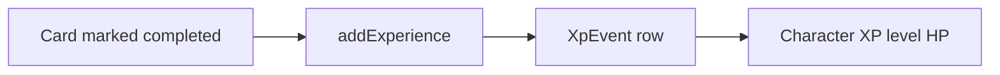
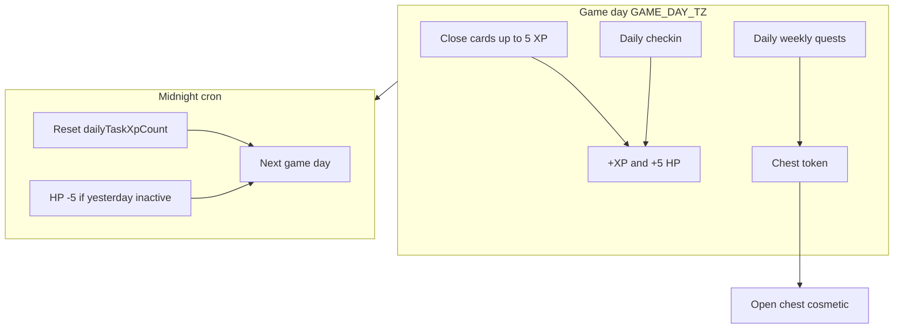

# Questflow — дорожная карта геймификации

docker compose up -d --build postgres redis app frontend

Документ для продукта и разработки: что уже сделано, куда движемся, обязательные принципы и черновые числа баланса. Сервер — источник истины; все начисления должны быть идемпотентны и аудируемы в PostgreSQL.

**Связанные файлы:** [README.md](../README.md), [gamification-agent-context.md](gamification-agent-context.md) (контекст для AI), [backend/prisma/schema.prisma](../backend/prisma/schema.prisma), [backend/src/character/](../backend/src/character/), [frontend/src/ProfileCharacterPage.tsx](../frontend/src/ProfileCharacterPage.tsx).

> **Для AI-агента:** перед задачей по геймификации читай [gamification-agent-context.md](gamification-agent-context.md). Не использовать `GAMIFICATION_ROADMAP (1).md` в корне — устаревший черновик.

---

## Ключевые решения (зафиксировано)

1. **Сначала починить суточный сброс** `dailyTaskXpCount` — без midnight job лимит «5 XP за карточки в день» перестаёт работать после первых пяти закрытий.
2. **Разделить XP и HP:** XP — долгий уровень; HP — ежедневная дисциплина (штраф за бездействие, восстановление через действия с наградой).
3. **Персонаж один на аккаунт;** прогресс учитывает активность в **любом** воркспейсе.
4. **Сундуки v1 — только косметика,** без статов и влияния на XP/HP (нет pay-to-win).
5. **Квесты выдают сундук (токен),** открытие сундука — отдельный момент награды (variable reward).
6. Каждая новая механика дублируется в UI-гайде на странице персонажа (как сейчас «Как это работает»).

---

## Цели и принципы

| Принцип | Описание |
|---------|----------|
| Над задачами, не вместо | Доски и карточки остаются ядром; геймификация мотивирует закрывать работу, а не блокирует её. |
| Один персонаж | `Character.userId` уникален; квесты и XP агрегируют действия пользователя по всем workspace. |
| Прозрачность | Правила и лимиты видны в профиле персонажа и в Swagger; неожиданных штрафов без предупреждения в UI избегать. |
| Аудит | `XpEvent` (и позже `HealthEvent`) — журнал начислений; unique constraints против дублей. |
| Мягкие потери | HP=0 — косметический статус, **без** блокировки досок и карточек. |
| Анти-фарм | Дневные лимиты, уникальность событий по `cardId` / `dayKey`. |

---

## Phase 0 — реализовано сейчас

| Область | Статус | Где в коде |
|---------|--------|------------|
| Персонаж (CRUD) | Готово | `backend/src/character/`, `POST/GET/PATCH /character` |
| Аватары | 12 preset (пол × класс) | `CharacterAvatarPreset` в Prisma |
| XP за первое закрытие карточки | +100 XP | `card.service.ts` → `characterService.addExperience` |
| Получатель XP | Исполнитель карточки, иначе тот, кто закрыл | `assigneeId ?? actorUserId` |
| Повторное закрытие | Без XP | unique `(userId, TASK_COMPLETED, cardId)` |
| Лимит XP за таски | max 5/сутки на персонажа | `dailyTaskXpCount`, `DAILY_TASK_XP_LIMIT` |
| Уровни | 1–100, кривая XP | `backend/src/character/config/level-curve.ts` |
| HP при награде XP | +5, max 100 | `CharacterService.addHealth()` |
| UI персонажа | Уровень, XP bar, HP, гайд | `frontend/src/ProfileCharacterPage.tsx` |

### Поток начисления (сейчас)



### Зарезервировано в схеме, но не в API

В Prisma уже есть типы `XpEventType`:

- `TASK_COMPLETED` — используется.
- `DAILY_CHECKIN` — не реализован.
- `CHECKIN_STREAK` — не реализован.

Поле `XpEvent.dayKey` и unique `(userId, type, dayKey)` подготовлены под чекины.

---

## Known gaps (критично до Phase 1)

| Проблема | Влияние | Планируемое исправление |
|----------|---------|------------------------|
| ~~`dailyTaskXpCount` не сбрасывается~~ | ~~После 5 закрытий XP за карточки больше не начисляется никогда~~ | **Fixed (0.5a):** cron `GamificationCronService.resetDailyTaskXpCounts` в 00:00 `GAME_DAY_TZ` |
| ~~Нет HP decay~~ | ~~HP только растёт при XP~~ | **Fixed (1b):** midnight cron + `HealthEvent` |
| ~~Нет чекинов~~ | ~~Enum есть, эндпоинтов нет~~ | **Fixed (1a):** `POST /character/checkin` |
| ~~Нет `@nestjs/schedule`~~ | ~~Нет фоновых джоб~~ | **Fixed (0.5a):** `ScheduleModule` + `GamificationCronService` (сброс XP-лимита; HP decay — Phase 1) |
| HP bar в UI | Всегда 100% ширина полосы | Привязать width к `health` |

---

## Столпы геймификации (обязательные)

Кратко: зачем столп и как он ложится на Questflow.

| Столп | Зачем | У нас |
|-------|-------|-------|
| **Clear goals** | Пользователь знает, что сделать сегодня | Дневные/недельные квесты; лимит 5 XP-тасков; чекин |
| **Feedback** | Действие сразу подкреплено | Toast/+XP при закрытии карточки; обновление профиля |
| **Progression** | Долгая мотивация | Уровни 1–100; коллекция косметики из сундуков |
| **Loss aversion (мягкая)** | Не бросать ритм | HP decay за день без активности; восстановление тасками/чекином |
| **Streaks** | Привычка заходить | Серия дневных чекинов + бонусы `CHECKIN_STREAK` |
| **Fair limits** | Нет бесконечного фарма | 5 XP/день за карточки; unique на события |
| **Autonomy** | Работа не наказывается | После лимита карточки закрываются без XP |
| **Social** (позже) | Команда | Лидерборд workspace — не v1 |

### Чего избегать

- Pay-to-win и статы на снаряжении в v1.
- Непрозрачные штрафы HP без текста в гайде.
- Разные определения «суток» в коде и в UI без `GAME_DAY_TZ` в документации.
- Блокировка Trello-функций при HP=0 или низком уровне.

---

## Экономика XP и HP

Единый конфиг (целевое расположение): `backend/src/gamification/config/rewards.ts` + зеркало `frontend/src/lib/xpRewards.ts`.

### XP

| Событие | XP | Лимит | Статус |
|---------|-----|-------|--------|
| Первое закрытие карточки | 100 | 5 раз / игровые сутки | **Реализовано** |
| Дневной чекин | 100 | 1 / сутки | **Реализовано (1a)** — `POST /character/checkin` |
| Недельный чекин | 200 | 1 / неделя (periodKey) | Planned |
| Streak 7 / 14 / 30 дней | 100 / 200 / 500 | Раз за milestone | Planned (`CHECKIN_STREAK`) |

**Игровые сутки:** граница по `GAME_DAY_TZ` (рекомендация: `Europe/Moscow` или `UTC`, одно значение в `.env`).

### HP

| Правило | Значение | Статус |
|---------|----------|--------|
| Максимум | 100 | Реализовано |
| За любое XP-событие с начислением | +5 | **Реализовано (1b)** в `addExperience` |
| Штраф за вчера без активности | −5 | **Реализовано (1b)** — cron `applyInactivityHpPenalty` |
| HP = 0 | Статус «истощён», доски не блокируются | Planned (UI) |

### Активность (для HP decay) — черновое правило

За **вчера** (календарный день в `GAME_DAY_TZ`) пользователь **активен**, если выполнено **хотя бы одно**:

1. Есть запись в `XpEvent` для `userId` за этот `dayKey`, **или**
2. Пользователь **первый раз** перевёл карточку в `isCompleted=true` в этот день (как assignee или как actor при закрытии — уточнить в Phase 1; рекомендация: засчитывать оба случая через audit поле `completedByUserId` на карточке или отдельную таблицу событий).

Если не активен → cron снимает 5 HP (идемпотентно: не штрафовать дважды за один `dayKey`).

**Grace period:** новый персонаж / аккаунт — без HP-штрафа первые 24 часа.

---

## Цикл «игрового дня» пользователя (целевой)



---

## Phase 0.5 — сброс суток и константы — **Done**

**Deliverables:**

- [x] `@nestjs/schedule`, `GamificationCronService`.
- [x] Job `0 0 * * *` (в `GAME_DAY_TZ`): сброс `dailyTaskXpCount`.
- [x] `backend/src/gamification/config/rewards.ts`; `character.service` / `card.service` без magic numbers.
- [x] `GAME_DAY_TZ` в `.env.example`; unit-тесты cron и `rewards`.
- [ ] E2E: после сброса снова можно получить XP за 5 карточек (ручной/regression).

**Зависимости:** нет (блокер для честного лимита 5/день снят).

---

## Phase 1 — чекины и HP cron

### Дневной / недельный чекин

| Endpoint | Назначение |
|----------|------------|
| `POST /character/checkin` | Дневной чекин, `DAILY_CHECKIN`, `dayKey = today` |
| `POST /character/checkin/weekly` | Опционально; `dayKey` = начало ISO-недели |

**Логика:**

- `addExperience(userId, 100, DAILY_CHECKIN, null)` с `dayKey` (кнопка или авто при первом XP за сутки, напр. карточка).
- Авто-чекин: первое XP-действие за день → +100 чекин **без HP**; карточка → +100 XP и +5 HP.
- При конфликте unique → `409 CHECKIN_ALREADY_DONE`.
- Streak: поля `checkinStreak`, `lastCheckinDay` на `Character` **или** вычисление из `XpEvent` (в MD рекомендуем поля на Character для быстрого UI).
- Milestone streak → `CHECKIN_STREAK` с синтетическим `dayKey` (идемпотентность по порогу 7/14/30): `gamification/config/checkin-streak-milestones.ts`, `checkin-streak-milestones.ts`.

**UI:** кнопка «Отметиться», индикатор серии, текст в гайде.

### HP decay cron

**Сервис:** `GamificationCronService.applyInactivityHpPenalty()`.

**Алгоритм:**

1. Выбрать персонажей с `health > 0`, не в grace period.
2. Для `yesterday` проверить активность (см. выше).
3. Если неактивен и нет `HealthEvent` за `(userId, dayKey)` → `health -= 5`, запись audit.
4. Идемпотентность: unique `(userId, dayKey)` на `HealthEvent`.

**Модель audit (концепт):**

```prisma
model HealthEvent {
  id        Int      @id @default(autoincrement())
  userId    Int      @map("user_id")
  dayKey    DateTime @db.Date
  delta     Int      // negative for penalty
  reason    String   // INACTIVITY_PENALTY | XP_REWARD_SYNC
  createdAt DateTime @default(now())

  @@unique([userId, dayKey, reason])
}
```

### Phase 1 — чеклист разработки

- [x] Миграция: `checkinStreak`, `lastCheckinDayKey`.
- [x] Пороги серии 7 / 14 / 30 → `CHECKIN_STREAK` (+200 / +400 / +800 XP), `streakMilestonesReached` в `rewards`.
- [x] `HealthEvent` + миграция `20260525103000_health_event`.
- [x] Check-in controller + Swagger (`POST /character/checkin`, 1a).
- [x] Cron HP penalty + `GAME_DAY_TZ` (в одном midnight job с reset XP).
- [x] HP +5 в `addExperience` (1b).
- [ ] Frontend: чекин, streak, HP bar по `health`, гайд.
- [ ] E2E: двойной чекин, штраф только раз, grace period.

---

## Phase 2 — квесты и сундуки (косметика)

### Модель данных (черновик)

```prisma
enum QuestPeriod {
  DAILY
  WEEKLY
}

enum QuestMetric {
  CARDS_COMPLETED
  CARDS_COMPLETED_WITH_DUE_TODAY
  COMMENTS_CREATED
  DAILY_CHECKIN_DONE
  ACTIVE_DAYS_WITH_XP
  DISTINCT_WORKSPACES_ACTIVE
}

model QuestTemplate {
  id            Int         @id @default(autoincrement())
  period        QuestPeriod
  metric        QuestMetric
  target        Int
  rewardChestTier ChestTier
  active        Boolean     @default(true)
}

model UserQuestProgress {
  id           Int      @id @default(autoincrement())
  userId       Int
  templateId   Int
  periodKey    String   // "2026-05-25" or "2026-W21"
  current      Int      @default(0)
  completedAt  DateTime?

  @@unique([userId, templateId, periodKey])
}

enum ChestTier {
  COMMON
  RARE
  EPIC
}

enum CosmeticType {
  AVATAR_PRESET
  PORTRAIT_FRAME
  PROFILE_BACKGROUND
  TITLE_BADGE
}

model CosmeticItem {
  id       Int          @id @default(autoincrement())
  type     CosmeticType
  key      String       @unique
  tier     ChestTier
}

model UserChest {
  id        Int       @id @default(autoincrement())
  userId    Int
  tier      ChestTier
  source    String    // QUEST_DAILY_BUNDLE, QUEST_WEEKLY_ALL
  openedAt  DateTime?
  createdAt DateTime  @default(now())
}

model InventoryItem {
  id              Int      @id @default(autoincrement())
  userId          Int
  cosmeticItemId  Int
  equipped        Boolean  @default(false)
  obtainedAt      DateTime @default(now())

  @@unique([userId, cosmeticItemId])
}
```

### Примеры квестов (rule-based)

**Дневные (pool, 3–4 активных в день):**

| Квест | Метрика | Target |
|-------|---------|--------|
| Закрыть 3 карточки | `CARDS_COMPLETED` | 3 |
| Закрыть карточку с дедлайном сегодня | `CARDS_COMPLETED_WITH_DUE_TODAY` | 1 |
| Оставить комментарий | `COMMENTS_CREATED` | 1 |
| Дневной чекин | `DAILY_CHECKIN_DONE` | 1 |

**Награда:** при выполнении всех дневных квестов периода → `UserChest` tier **Common**. Отдельные квесты могут давать прогресс без сундука (настраивается в template).

**Недельные:**

| Квест | Метрика | Target |
|-------|---------|--------|
| Закрыть 15 карточек | `CARDS_COMPLETED` | 15 |
| 5 дней с ≥1 XP-событием | `ACTIVE_DAYS_WITH_XP` | 5 |
| Активность в 2 воркспейсах | `DISTINCT_WORKSPACES_ACTIVE` | 2 |

**Награда:** все недельные выполнены → **Rare**; бонус за 7/7 дней чекина → **Epic** (опционально).

### Сундуки v1 — только косметика

| Tier | Источник | Содержимое (примеры) |
|------|----------|----------------------|
| Common | Все дневные квесты дня | Рамка, badge, редкий duplicate → dust (Phase 3) |
| Rare | Недельный bundle | Новый avatar preset, фон профиля |
| Epic | Streak / особое недельное | Эксклюзивный preset / рамка |

**Открытие:** `POST /character/chests/:id/open` → weighted roll по `LootTable` → `InventoryItem`. Дубликат: в Phase 3 конвертация в «пыль»; в Phase 2 — сообщение «уже есть» без ломания UX.

**Экипировка:** `PATCH /character/cosmetics/equip` — рамка, фон, title; avatar preset остаётся в существующем `updateCharacter` с проверкой владения.

### Quest engine (поведение)

- Прогресс обновляется в тех же транзакциях, где карточка закрыта / комментарий создан / чекин (hook из сервисов, не только cron).
- `periodKey` пересчитывается в `GAME_DAY_TZ`.
- Завершение квеста → создать `UserChest` если ещё не выдан за этот bundle.

---

## Phase 3 — backlog

| Идея | Описание |
|------|----------|
| Пыль (dust) | Дубликаты косметики → валюта на выбор из loot table |
| Achievements | One-time из агрегатов `XpEvent` |
| Battle pass | 4-недельный сезон с треком наград |
| Уведомления | Email / in-app: «завтра −5 HP», «сундук готов» |
| Лидерборд workspace | Топ по XP за неделю в WS (opt-in) |
| Командные weekly goals | Общий прогресс WS — отдельная фаза |

---

## Roadmap по фазам (для агента)

| Phase | Deliverable | Зависимости |
|-------|-------------|-------------|
| **0** | Персонаж, XP за карточки, уровни, HP+5 | — |
| **0.5** | Сброс `dailyTaskXpCount`, `rewards.ts` | schedule |
| **1a** | Check-in API, streak, UI | XpEvent types |
| **1b** | HP decay cron, `HealthEvent` | schedule, правило активности |
| **2a** | Quest templates + progress hooks | карточки, комментарии, чекин |
| **2b** | Chests, inventory, equip cosmetic | Prisma models |
| **3** | Dust, achievements, notifications | optional |

---

## Технический чеклист

- [ ] **Идемпотентность:** unique на `(userId, type, cardId)` и `(userId, type, dayKey)`; то же для HP penalty.
- [ ] **Транзакции:** `addExperience` + quest progress + chest grant в `$transaction` где связано.
- [ ] **Логи:** Pino — `userId`, `eventType`, `xpAmount`, `questId`, `chestId`.
- [ ] **Конфиг:** один `rewards.ts`, без магических чисел в сервисах.
- [ ] **Тесты:** лимит 5, повтор карточки, двойной чекин, cron dry-run, grace HP.
- [ ] **Frontend:** константы из `xpRewards.ts`, гайд обновлять синхронно с backend.
- [ ] **Swagger:** все новые эндпоинты с кодами ошибок (`DAILY_TASK_XP_LIMIT`, `XP_EVENT_ALREADY_RECORDED`, …).

### Коды ошибок (расширение)

| Code | Когда |
|------|-------|
| `DAILY_TASK_XP_LIMIT` | 5 XP за карточки исчерпаны |
| `XP_EVENT_ALREADY_RECORDED` | Повторное событие |
| `CHECKIN_ALREADY_DONE` | Чекин за сегодня |
| `CHEST_ALREADY_OPENED` | Повторное открытие |
| `COSMETIC_NOT_OWNED` | Экипировка без inventory |

---

## Открытые решения (обсудить перед кодом)

| # | Вопрос | Варианты | Рекомендация |
|---|--------|----------|--------------|
| 1 | TZ суток | UTC / `Europe/Moscow` / per-user | Один `GAME_DAY_TZ` в env, документировать в UI |
| 2 | Активность для HP | Только `XpEvent` / любое закрытие карточки / логин | XP или закрытие карточки (ближе к «работе») |
| 3 | Предупреждение HP | Тихий штраф / баннер «завтра −5» | Баннер в профиле если вчера уже неактивен сегодня |
| 4 | Weekly check-in | Отдельная кнопка / только weekly quests | Объединить с weekly quest bundle |
| 5 | Кто закрыл карточку | Только assignee XP / actor при отсутствии assignee | Текущее поведение сохранить |
| 6 | Недельный periodKey | ISO week / скользящие 7 дней | ISO week в `GAME_DAY_TZ` |

---

## Ссылки на реализацию Phase 0

| Файл | Назначение |
|------|------------|
| [backend/src/character/character.service.ts](../backend/src/character/character.service.ts) | `addExperience`, HP, лимит 5 |
| [backend/src/card/card.service.ts](../backend/src/card/card.service.ts) | Начисление при `setCardCompletion` |
| [backend/src/gamification/config/rewards.ts](../backend/src/gamification/config/rewards.ts) | XP за таск, дневной лимит, HP-константы |
| [backend/src/character/config/level-curve.ts](../backend/src/character/config/level-curve.ts) | Кривая уровней |
| [backend/prisma/schema.prisma](../backend/prisma/schema.prisma) | `Character`, `XpEvent`, enums |
| [frontend/src/lib/xpRewards.ts](../frontend/src/lib/xpRewards.ts) | Константы для UI |
| [frontend/src/ProfileCharacterPage.tsx](../frontend/src/ProfileCharacterPage.tsx) | Отображение и гайд |

---

*Продуктовый roadmap. Контекст для агента: [gamification-agent-context.md](gamification-agent-context.md). При фазах обновлять оба файла + Known gaps и таблицы XP/HP.*
