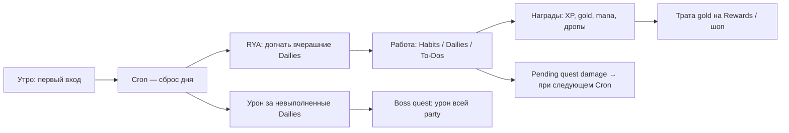

# Habitica — справочник по механикам

Обзор продукта [Habitica](https://habitica.com/) (open-source habit tracker + RPG) для сравнения с Questflow. Источники: [официальная вики](https://habitica.fandom.com/wiki/Habitica_Wiki), страницы Habits, Dailies, Quests, Party, Class System, Achievements (май 2026).

> **Заметка:** часть социальных функций эволюционировала (например, гильдии [сокращены/закрыты в 2023](https://habitica.fandom.com/wiki/Guilds)); ядро — задачи, персонаж, party и квесты.

---

## 1. Концепция и ежедневный workflow

Habitica превращает реальные привычки и дела в RPG: пиксельный аватар, уровень, золото, HP, мана, экипировка и питомцы. Продуктивность = выполнение задач в приложении; пропуски бьют по HP (и по party на boss-квестах).

### Типичный цикл дня

1. **Первый вход за «день»** запускает **Cron** (граница суток настраивается — Custom Day Start).
2. **Record Yesterday's Activity (RYA)** — попап: можно отметить вчерашние Dailies до начисления урона.
3. В течение дня игрок отмечает задачи; награды начисляются сразу, **прогресс квеста** (урон боссу / дропы коллекции) копится как *pending* и применяется на **следующем Cron**.
4. Невыполненные **Dailies** → потеря HP, сброс streak, меньше mana на Cron; на boss-квесте — дополнительный урон **всем** участникам квеста.
5. **Pause Damage / Inn** — пауза урона от Dailies (не отменяет изменение value у Habits/To-Dos).

---

## 2. Четыре колонки задач (ядро workflow)

На странице Tasks четыре зоны ([Establishing Your Tasks](https://habitica.fandom.com/wiki/Establishing_Your_Tasks)):

| Тип | Назначение | Награда | Штраф |
|-----|------------|---------|-------|
| **Habits** | Действия без фиксированного расписания; +/- кнопки | + → XP, gold, mana; шанс дропа | − → потеря HP и mana (mana не ниже 0) |
| **Dailies** | Повтор по дням недели / интервалу | XP, gold, mana, streak, дропы | В конце дня: HP; сброс streak; boss-урон party |
| **To-Dos** | Разовые задачи | XP, gold при выполнении; «старые» дают больше | Нет урона за просрочку; задача «краснеет» (растёт value) |
| **Rewards** | Покупка за gold: внутриигровое (броня) и **свои** реальные награды | — | Трата gold |

### Общие настройки задач

- **Difficulty:** trivial / easy / medium / hard — масштабирует награды и штрафы ([Habits](https://habitica.fandom.com/wiki/Habits), [Dailies](https://habitica.fandom.com/wiki/Dailies)).
- **Task value** (цвет: жёлтый → красный): чем дольше откладываешь To-Do / не делаешь Daily, тем выше value; выполнение «красной» задачи даёт больше XP/gold и **больше урона боссу**.
- **Checklists** на Dailies и To-Dos: частичное выполнение снижает урон от Daily; каждый пункт checklist ≈ дополнительный To-Do для XP.
- **Tags, заметки, напоминания** — организация без влияния на боевую формулу.

### Выбор типа задачи (правило вики)

- Нет жёсткого дедлайна, но хочешь поощрять/наказывать спонтанно → **Habit**.
- Обязательство «в эти дни недели» → **Daily** (перегруз → часть в Habits).
- Разовый проект → **To-Do**.

---

## 3. Персонаж и геймификация прогресса

### Ресурсы

| Ресурс | Роль |
|--------|------|
| **HP** | «Жизнь»; 0 HP → смерть персонажа (потеря уровня, gold, один уровень; экипировка остаётся) |
| **XP** | Уровень; при level-up — stat points, полное восстановление HP |
| **Gold (GP)** | Магазин, кастомные Rewards, карточки party |
| **Mana (MP)** | Классовые скиллы; реген на Cron и от задач |

### Четыре стата ([Character Stats](https://habitica.fandom.com/wiki/Character_Stats))

| Stat | Влияние |
|------|---------|
| **STR** | Криты, урон боссу, сила warrior/rogue-скиллов |
| **CON** | Max HP, защита от урона задач |
| **INT** | XP, max MP (+1 MP за point INT) |
| **PER** | Gold и шанс дропов с задач |

Stat points — при level-up; также броня/оружие и баффы party.

### Классы (с level 10, до этого все как Warrior)

| Класс | Primary | Secondary | Роль |
|-------|---------|-----------|------|
| **Warrior** | STR | CON | Урон боссу, криты, бафф STR/CON party |
| **Mage** | INT | PER | Быстрый XP/MP, Burst of Flames по боссу, бафф INT / восстановление MP party |
| **Healer** | CON | INT | Лечение, защита party |
| **Rogue** | PER | STR | Gold/дропы, скиллы вне «задач» не дают quest items |

С level 60 — **subclasses** (Blademaster, Sage, Traveling Doctor, Ninja и др.) с уникальными перками.

Скиллы party **стакаются** до Cron каждого игрока; эффект от **статов кастера**, не цели.

### Экипировка, питомцы, маунты

- **Equipment** — статы; часть только из квестов / легендарных линий.
- **Pets** — яйца + hatching potions (дропы, квесты, маркет); кормление → **mount**.
- **Costume** — визуал без смены статов.
- Достижения **Beast Master / Mount Master / Triad Bingo** — коллекция gen-1 питомцев/маунтов (можно «освободить» в Kennels для повторного стака ачивки).

### Rebirth и мета-прогресс

- **Orb of Rebirth** (level 50+, gems): сброс уровня к 1, сохранение ачивок/коллекций; смена класса; бесплатно с level 100+ раз в 45 дней.
- **Check-In Incentives** — награды за серию входов (в т.ч. quest scrolls).

### Случайность

- **Critical hits** на задачах (STR).
- **Drops** после 2+ задач за день: food, eggs, potions (PER).
- Квестовые дропы отделены от обычных.

---

## 4. Социальное взаимодействие

### Party (основной социальный слой)

- **1–30** участников; можно solo-party для квестов.
- **Чат party** — координация, лог квеста (урон, старт/финиш), скиллы.
- Видны **аватар, статы, профиль, ачивки**; **чужие задачи не видны**, кроме задач из **challenges**, в которые вступил игрок.
- **Приглашения** по @username или email (новым пользователям — квест *Basi-List* при принятии).
- **Party leader** — кик, смена лидера, описание, кто может создавать party challenges.
- **Карточки** (10 GP): greeting, thank-you, get well и т.д. — stackable achievements.
- **Transformation items** (сезонно): косметика на аватаре друга.

### Challenges

- Создатель задаёт **набор задач** (копируются участникам) + опционально **приз** (gems и т.д.).
- Места: **party**, публичный **Tavern**, раньше — **guilds** (функция сужена).
- Участник **join** → задачи в свой список; **выход** — задачи остаются, но не синхронизируются.
- Победитель(и) — по метрике challenge (выполнение, streak и т.п.); badge **Challenges Won** в профиле.

### Guilds (исторический контекст)

- Тематические сообщества, чат, challenges; **achievement «Joined a Guild» retired 08.08.2023**.
- Для LFG остаются публичные guild вроде *Party Wanted*.

### Tavern

- Глобальный чат; публичные challenges; меньше accountability, чем party.

### World Boss

- Событие **на весь сайт**: урон боссу как в party, **игроки не получают урон**; заполняется strike bar → атака NPC; награда всем — особый pet/mount.

---

## 5. Квесты (Quests)

Квесты — **story missions** party; нужна party (хотя бы 1 человек). Запуск: **quest scroll** из инвентаря → инвайт → accept / Begin.

### Типы квестов ([Quests](https://habitica.fandom.com/wiki/Quests))

| Тип | Прогресс | Риск |
|-----|----------|------|
| **Boss** | Урон боссу от +Habits, Dailies, To-Dos (и скиллы Mage/Warrior) | Пропущенные Dailies **любого** участника → урон **всей** party (× boss strength); даже в Inn |
| **Collection** | Дропы quest items в общий пул | Нет boss-урона за Dailies |
| **Pet / Magic potion** | Награды: яйца, potions, особые pets | Часто boss-обёртка |
| **Equipment lines** | Легендарная экипировка по уровням | Линейки с unlock по level / предыдущему квесту |

### Как считается прогресс

- Выполнение задач в течение дня → **pending damage/collection**.
- На **Cron** игрока: применение к боссу/party, сообщение в party chat.
- Задачи/скиллы **до старта** квеста, но до Cron — засчитываются ретроактивно при старте в тот же «день».
- Урон боссу: зависит от **STR**, **task value**, difficulty, critical; формула масштаба ~ `damage * (1 + STR/200)` (из обсуждений разработчиков).
- Habits: ~половина множителя относительно Dailies/To-Dos.
- **Rage bosses**: шкала rage = полученный party урон; при заполнении — heal босса / сброс прогресса / drain MP.

### Награды квеста

- Одинаковы для всех принявших квест до конца (**не** зависят от личного вклада).
- Gold, XP, equipment, eggs, potions, food, scrolls, иногда pet/mount напрямую.
- Запись в **Quests Completed** на профиле.

### Экономика scrolls

- **Quest Shop**: gold / gems; pet quests часто 4 gems; сезонные bundle.
- **Unlock**: level milestones, check-in streak, награда за предыдущий квест в линии.
- Одновременно **один** party-квест (+ редкий world boss).

### Мотивация (дизайн)

- Долгая цель + ежедневный логин.
- **Social accountability**: мой провал Daily бьёт друзей.
- Эксклюзивная экипировка и ускорение коллекции питомцев.

---

## 6. Достижения (Achievements)

Вкладка **Achievements** в профиле: badge + описание; часть **stackable** (число на иконке).

### Категории (сводка)

| Группа | Примеры |
|--------|---------|
| **Basic** | 21-day streaks на Dailies (+0.5% drop each); Perfect Days (все Dailies) → buff stats на след. день; Party Up / Party On; Invited a Friend |
| **Quest / коллекции** | Quest Completionist (Masterclasser); Mind Over Matter; Seasonal Specialist; Ultimate Gear по классу |
| **Питомцы** | Back to Basics, Beast Master (×N), Mount Master, Triad Bingo |
| **Социальные** | Cheery Chum, Challenges Won (список побед) |
| **Onboarding** | Создание задач, класс, первый квест |
| **Rebirth** | Began a New Adventure (stackable, +5% drop bonus) |
| **Retired** | Kickstarter, Joined a Guild, старые seasonal |

Просмотр чужого профиля: из чата party или клик по аватару — видны badges и (на web) выигранные challenges.

---

## 7. Монетизация и мета-шопы

- **Gems** — premium: квесты, косметика, rebirth, некоторые скроллы; поддержка open-source проекта.
- **Gold** — только игровая активность.
- **Market, Quest Shop, Seasonal Shop, Time Travelers** (Mystic Hourglass) — разные витрины.
- **Group Plan** — платная подписка на party (лидер контролирует инвайты).

---

## 8. API и интеграции

- REST API v3: `https://habitica.com/api/v3/` (заголовки `x-api-user`, `x-api-key`).
- CRUD задач, профиль, party — для ботов и внешних тулов (Todoist-подобные сценарии у сообщества).

---

## 9. Сравнение с Questflow (кратко)

| Аспект | Habitica | Questflow (из roadmap) |
|--------|----------|-------------------------|
| Ядро | Отдельный habit tracker | Trello-доски и карточки |
| Штрафы | HP, смерть, party damage | HP мягкий, без блокировки досок |
| Социалка | Party + challenges + (бывш.) guilds | Квесты, workspace; party TBD |
| Квесты | Scroll, boss/collection, gems | Квесты → сундук (косметика v1) |
| Pay-to-win | Gems → квесты/косметика | Сундуки без статов |
| Сутки | Cron per user | `dailyTaskXpCount` + midnight job |

---

## 10. Полезные ссылки

- Сайт: [habitica.com](https://habitica.com/)
- Вики: [Habitica Wiki](https://habitica.fandom.com/wiki/Habitica_Wiki)
- Задачи: [Habits](https://habitica.fandom.com/wiki/Habits), [Dailies](https://habitica.fandom.com/wiki/Dailies), [Establishing Your Tasks](https://habitica.fandom.com/wiki/Establishing_Your_Tasks)
- Социалка: [Party](https://habitica.fandom.com/wiki/Party), [Quests](https://habitica.fandom.com/wiki/Quests), [Boss](https://habitica.fandom.com/wiki/Boss)
- Прогресс: [Class System](https://habitica.fandom.com/wiki/Class_System), [Achievements](https://habitica.fandom.com/wiki/Achievements)
- Репозиторий: [HabitRPG/habitica](https://github.com/HabitRPG/habitica) (open source)

---

*Документ для продуктовых решений Questflow; не официальная документация Habitica. При расхождении с вики приоритет у вики.*
