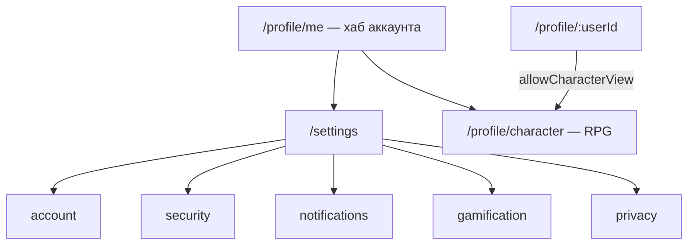

# Questflow — дорожная карта профиля и настроек

Документ для продукта и разработки: личный кабинет (`/profile/me`), настройки аккаунта (`/settings`), приватность и публичный профиль участника. **Не путать** с геймификацией — прогресс персонажа описан в [gamification-roadmap.md](gamification-roadmap.md).

**Связанные файлы:** [README.md](../README.md), [gamification-agent-context.md](gamification-agent-context.md), [backend/prisma/schema.prisma](../backend/prisma/schema.prisma) (`User`, `UserSettings`), [backend/src/user/](../backend/src/user/), [backend/src/user-settings/](../backend/src/user-settings/), [frontend/src/pages/settings/SettingsPage.tsx](../frontend/src/pages/settings/SettingsPage.tsx), [frontend/src/app/AppRoot.tsx](../frontend/src/app/AppRoot.tsx) (`ProfileMePage`).

> **Для AI-агента:** задачи по **аккаунту, email, сессиям, privacy, удалению** — этот файл. Задачи по XP, квестам, сундукам — [gamification-agent-context.md](gamification-agent-context.md).

---

## Ключевые решения (зафиксировано)

1. **Два слоя профиля:** аккаунт (`/profile/me`, `/settings`) и RPG-прогресс (`/profile/character`) — разные экраны, не сливать в один.
2. **Email чужому пользователю не показываем** — инвариант API и UI (не переключатель в privacy).
3. **Экспорт данных (GDPR JSON) не делаем** — удаление аккаунта внизу вкладки account.
4. **Редактирование аватара и имени** остаётся на хабе `/profile/me`; в settings — просмотр, смена email, безопасность, privacy, уведомления.
5. **Просмотр персонажа другими** — настраивается (`allowCharacterView`); сервер проверяет при `GET /character/:userId` и при CTA на публичном профиле.
6. **Удаление аккаунта** — отдельная Phase C; до реализации зафиксировать стратегию (см. [Phase C](#phase-c--удаление-аккаунта)).

---

## Согласованный scope (релиз профиля)

| # | Фича | Статус |
|---|------|--------|
| 1 | Хаб `/profile/me` (шапка аккаунта + карточки: персонаж, приглашения, настройки) | Done |
| 2 | Скрыть email на чужом `/profile/:userId` | Done |
| 3 | Вкладки `/settings`: account · security · notifications · gamification · privacy | Done |
| 4 | Смена email с подтверждением (старая + новая почта) | Done |
| 5 | Пароль только в `/settings/security` (убрать дубль с `/profile/me`) | Done |
| 6 | Вкладка уведомлений (email + in-app) | Done |
| 7 | Удаление аккаунта (вкладка account, внизу) | Done |
| 8 | Privacy: просмотр персонажа другими; видимость аватара аккаунта на публичном профиле | Done |
| 9 | Социальное на `UserProfilePage`: в друзья / сообщение | Done |

### Вне scope (ближайший релиз)

| Фича | Примечание |
|------|------------|
| Экспорт данных | Явно не нужен |
| Синхронизация темы в `UserSettings` | Тема остаётся в localStorage (меню аватара) |
| Бейдж / resend верификации email в профиле | Flow есть в auth, UI в профиле не планируем |
| UI привязки Google (link/unlink) | OAuth при входе есть, отдельный экран — позже |
| 2FA, push, i18n, timezone в UI | Backlog |

### Уже реализовано (не ломать при рефакторинге)

| Фича | Где |
|------|-----|
| Аватар аккаунта (upload/delete) | `PATCH /user/update-avatar`, `ProfileMePage` |
| Имя (3–18 символов) | `PATCH /user/me` |
| Email read-only на своём профиле | `/profile/me` |
| Пароль: установка / смена | `POST /auth/password/change`, модалка на `/profile/me` |
| Сессии + «завершить другие» + журнал безопасности | `/settings/security` |
| 2 тоггла геймификации | `/settings/gamification`, `UserSettings.gamification` |
| OAuth Google при входе | `auth.controller`, README |
| Персонаж, квесты, друзья, DM, рейд | `/profile/character` |
| Чужой профиль (имя, аватар, email, ссылка на персонажа) | `/profile/:userId` — **email убрать в Phase A** |
| Социальное на чужом персонаже | `UserCharacterPage` |

---

## Текущее состояние (baseline)

| Маршрут | Содержимое |
|---------|------------|
| `/profile/me` | Аватар, имя, email, дата регистрации, модалка пароля |
| `/settings`, `/settings/security`, `/settings/gamification` | Security + gamification; смена email — текст «в разработке» |
| `/profile/character` | RPG: уровень, HP, квесты, друзья, сообщения, рейд |
| `/profile/:userId` | Публичный профиль (workspace **или** дружба); без email |
| `/profile/:userId/character` | Публичный персонаж; кнопка «в друзья» |
| `/profile/user/:userId` | Редирект-совместимость → `/profile/:userId` |
| Меню аватара | Профиль, Персонаж, Приглашения, Настройки, тема (localStorage) |

**Модель данных:**

- `User` — `email`, `name`, `avatarPath`, `emailVerifiedAt`, `passwordHash`, OAuth
- `UserSettings` — `gamification` (2 поля), `site` и `security` — пустые JSON `{}` ([`default-user-settings.ts`](../backend/src/user-settings/config/default-user-settings.ts))

---

## Целевая информационная архитектура

### `/profile/me` — хаб аккаунта

1. **Шапка** — аватар, имя (редактирование здесь), email (только владельцу), дата регистрации.
2. **Карточки-навигация** — Персонаж · Приглашения (badge) · Настройки · Workspaces.
3. **Без** модалки пароля — ссылка «Безопасность» → `/settings/security`.

### `/settings` — вкладки

| Вкладка | URL | Содержимое |
|---------|-----|------------|
| account | `/settings/account` | Email, смена email, сводка аккаунта, ссылка «Изменить аватар и имя» → `/profile/me` |
| security | `/settings/security` | Пароль (единственное место), сессии |
| notifications | `/settings/notifications` | Email: security, invites; in-app: XP toasts (связь с gamification) |
| gamification | `/settings/gamification` | Текущие 2 switch + будущие RPG-настройки UI |
| privacy | `/settings/privacy` | См. таблицу ниже |
| account (низ) | `/settings/account` | Удаление аккаунта (внизу вкладки) |

[`settingsRoutes.ts`](../frontend/src/pages/settings/settingsRoutes.ts): `account | security | notifications | gamification | privacy`. Старый URL `/settings/data` → account.

---

## Privacy — спецификация

### Инварианты (не настраиваются)

- Email **никогда** не возвращается в `UserProfileView` для viewer.
- Просмотр публичного профиля: общий workspace **или** дружба (`getProfileForViewer`).

### Настройки (хранить в `UserSettings`, блок `privacy`)

| Ключ | Тип | Default | Поведение |
|------|-----|---------|-----------|
| `allowCharacterView` | `boolean` | `true` | Если `false`: `GET /character/:userId` для чужого → 403; на `/profile/:userId` нет кнопки «Персонаж»; при прямом URL — заглушка «Персонаж скрыт» |
| `showAccountAvatarOnPublicProfile` | `boolean` | `true` | Если `false`: на `/profile/:userId` — инициалы вместо фото аккаунта (RPG-портрет не подменяет аватар аккаунта на этом экране) |

**Проверки на сервере:**

- `UserService.getProfileForViewer` — DTO без email; учёт `showAccountAvatarOnPublicProfile`.
- `CharacterService` (или guard) — `allowCharacterView` для viewer ≠ owner.
- `UserSettingsService` — `PATCH` privacy + `UserSecurityEvent` при изменении.

**Frontend:**

- [`UserProfilePage.tsx`](../frontend/src/pages/user-profile/UserProfilePage.tsx) — убрать email; social CTA; условный «Персонаж».
- [`UserCharacterPage.tsx`](../frontend/src/pages/user-character/UserCharacterPage.tsx) — обработка 403 / скрытый персонаж.

---

## Уведомления (минимум v1)

| Канал | Событие | Default |
|-------|---------|---------|
| Email | Новый вход / смена пароля | on |
| Email | Приглашение в workspace | on (уже в продукте) |
| In-app | XP / HP после карточки | связано с `xpGainNotifications` |
| In-app | Анимация чекина | связано с `checkinAnimationOnCardClose` |

Хранение: `UserSettings.site.notifications`. **Отправка:** `UserSettingsService.allowsSecurityEmail` / `allowsWorkspaceInviteEmailForAddress` — auth (verify, reset), смена email, приглашения в workspace (для зарегистрированных получателей; на неизвестный email письмо всегда уходит).

---

## Смена email (Phase B)

1. Пользователь вводит новый email в `/settings/account`.
2. Письмо на **старый** email (подтверждение отмены/согласия).
3. Письмо на **новый** email (подтверждение владения).
4. После обоих подтверждений — обновление `User.email`, запись в `UserSecurityEvent`.
5. Инвалидация других сессий (опционально, зафиксировать при реализации).

Стек: SendGrid (уже в проекте), `AuthToken` или отдельные токены смены email.

---

## Удаление аккаунта (Phase C)

**В scope:** кнопка внизу вкладки `account`, подтверждение (пароль или фраза `УДАЛИТЬ`).

**Вне scope:** экспорт перед удалением.

**Решение при реализации (выбрать одно):**

| Вариант | Плюсы | Минусы |
|---------|-------|--------|
| Hard delete + cascade | Просто, GDPR «право на удаление» | Потеря истории workspace activity |
| Soft delete 30d | Восстановление | Сложнее, cron очистки |

Рекомендация для документа: **hard delete** с каскадом Prisma на `User` (персонаж, сессии, settings, social) — согласовать с владельцем workspace (карточки остаются, assignee null).

---

## Фазы реализации (код)

### Phase A — Privacy и хаб

- [x] Вынести `ProfileMePage` из `AppRoot.tsx` → `frontend/src/pages/profile-me/ProfileMePage.tsx`
- [x] Хаб: шапка + карточки навигации
- [x] `UserProfileView` без `email`; UI `UserProfilePage`
- [x] Вкладки settings (account/notifications/privacy; удаление — внизу account)
- [x] `privacy` в `UserSettings.security` + API `PATCH /user/me/settings/privacy` + UI
- [x] Enforcement `allowCharacterView` на `GET /character/user/:userId`
- [x] Social CTA на `UserProfilePage` (логика с `UserCharacterPage`)

### Phase B — Account и security

- [x] Flow смены email (`UserEmailChangeService`, токены `EMAIL_CHANGE_OLD` / `EMAIL_CHANGE_NEW`, redirect `/settings/account?emailChange=…`)
- [x] Пароль только в security; `#password` → `/settings/security#password`
- [x] Вкладка notifications + `PATCH /user/me/settings/notifications`

### Phase C — Удаление аккаунта

- [x] `DELETE /user/me` (пароль или фраза `УДАЛИТЬ`)
- [x] UI account (низ вкладки) + модалка + logout через `onAccountDeleted`
- [x] Тесты `user.service` (deleteAccount), frontend `SettingsDeleteAccountPanel`

### Backlog (упомянуть в PR, не блокирует A–C)

- 2FA TOTP
- Google link/unlink UI
- Синхронизация темы в аккаунте
- Бейдж email verified
- Блокировка пользователя
- i18n, push, timezone display

---

## Карта файлов (при реализации)

| Задача | Backend | Frontend |
|--------|---------|----------|
| Profile DTO | `user/interface/`, `user.service.ts` | `UserProfilePage.tsx`, `profile-me/` |
| Privacy settings | `user-settings/dto/`, `lib/settings-json.ts`, `user-settings.service.ts` | `SettingsPage.tsx`, `entities/user-settings/` |
| Character visibility | `character.service.ts` или guard | `UserCharacterPage.tsx` |
| Change email | `auth/` или `user/` + mail | `settings/account` section |
| Delete account | `user.controller.ts`, `user.service.ts` | `settings/account` (низ вкладки) |
| Routes | — | `settingsRoutes.ts`, `AppRoot.tsx` routing |

---

## Популярные фичи (справочник)

Полный рынокный чеклист для сравнения; **жирным** — входит в согласованный scope.

| Категория | Фича | Questflow |
|-----------|------|-----------|
| Идентичность | Аватар, имя | Done |
| | **Смена email** | Planned |
| | Bio / @username | Backlog |
| Безопасность | Пароль, сессии, журнал | Done / **унификация пароля** Planned |
| | 2FA | Backlog |
| Приватность | **Скрыть email** | Planned |
| | **Кто видит персонажа** | Planned |
| | **Аватар на публичном профиле** | Planned |
| Приложение | Тема | Done (local) |
| | Язык, timezone | Backlog |
| Уведомления | **Матрица email/in-app** | Planned |
| Данные | Export | **Вне scope** |
| | **Удаление аккаунта** | Planned |
| Социальное | **Друзья/сообщение на профиле** | Planned |
| RPG | Персонаж отдельно | Done — [gamification-roadmap.md](gamification-roadmap.md) |

---

## Чеклист после итерации по профилю

- [x] Privacy: чужой API не отдаёт email (тест `user.service`)
- [x] `allowCharacterView: false` блокирует character для viewer (тест)
- [x] Новые коды ошибок → `API_ERROR_CODE_RU` в `api.ts` (`CHARACTER_VIEW_DISABLED`, `EMAIL_UNCHANGED`, `CONFIRM_PHRASE_REQUIRED`)
- [x] Обновить этот файл (галочки Phase A–C)
- [x] Не дублировать константы геймификации — ссылка на `gamification-agent-context.md`
- [x] `npm run test` (profile-related backend + frontend vitest)

---

*Обновлять при каждой итерации по профилю и настройкам (статус фаз, новые инварианты).*
